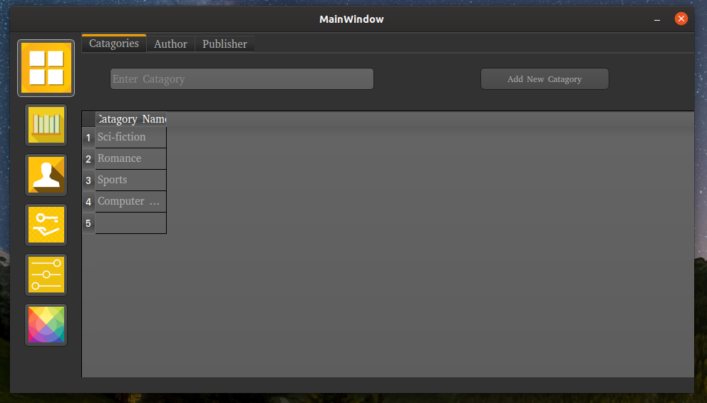

# Library Management System using PyQT5

## Tools
* Qt5 Designer
* Editor (i.e; Pycharm, vscode, etc.)
* MySQL Server
* MySQL Workbench


## Project Structure Front-end
Demo [video](https://www.youtube.com/watch?v=q-ZsXnnRpBo)

[](https://www.youtube.com/watch?v=YOUTUBE_VIDEO_ID_HERE)

### Splash Window:


* Image on it 
* With progress using QThreads


### Login Window:


* Username
* Password

### Library Window:



#### Dashboard Objects:
* Book title
* Client name
* Type Retrive/Rent
* Days [1-12]
* Report [Export to xlsx file]

#### Book Objects:
* Show all books
* Add book
* Edit/Delete book
* Report [Export to xlsx file]

#### User Objects:
* Add new user with username & password
* Login
* Edit user detail

#### Client Objects:
* Show all clients
* Add new client
* Edit/Delete client
* Report [Export to xlsx file]

#### Client Objects:
* Show all clients
* Add new client
* Edit/Delete client
* Report [Export to xlsx file]

#### Setting Objects:
* Add catagory
* Add author
* Add publisher

#### Theme Objects:
* Dark Orange
* Dark Blue
* Dark Gray
* QDark


## Conversion of .qrc Into .py
```pyrcc5 icons.qrc -o icons_rc.py```

## Conversion of <name>.ui into <name>.py
```pyuic5 -o <name>.py <name>.ui```

## Project Structure Back-end

### MySQL Database:


